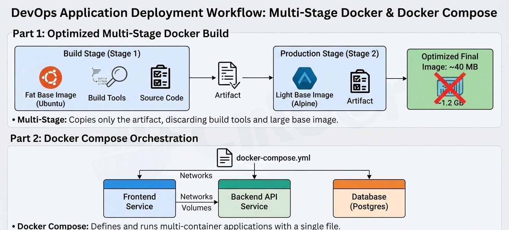

# Docker Multi-Stage & Compose Demo

A simple demo project showcasing **Docker**, **Multi-Stage Builds**, and **Docker Compose**.

## 🖼️ Project Architecture Overview


 📂 Project Structure
```text
.
├── image_0.png         # Architecture diagram image
├── Dockerfile          # Multi-stage build configuration
├── docker-compose.yml  # Services orchestration
├── requirements.txt    # Dependencies (Python demo)
└── app.py               #Application code (Python demo)
